## Setup and technologies used in this Project


As a member of a DevOps team, you will implement a tooling website solution which makes access to DevOps tools within the corporate infrastructure easily accessible.
In this project you will implement a solution that consists of following components:

**`Infrastructure:`** AWS

**`Webserver Linux:`** Red Hat Enterprise Linux 8

**`Database Server:`** Ubuntu 20.04 + MySQL
Storage Server: Red Hat Enterprise Linux 8 + NFS Server

**`Programming Language:`** PHP

On the diagram below you can see a common pattern where several stateless Web Servers share a common database and also access the same files using Network File Sytem (NFS) as a shared file storage. Even though the NFS server might be located on a completely separate hardware – for Web Servers it look like a local file system from where they can serve the same files.

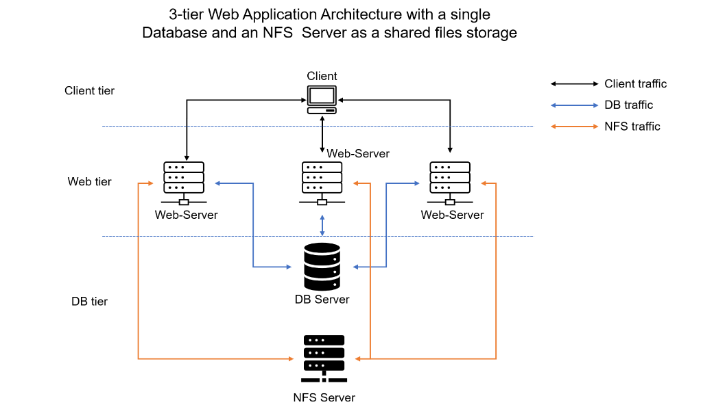

It is important to know what storage solution is suitable for what use cases, for this – you need to answer the following questions: what data will be stored, in what format, how this data will be accessed, by whom, from where, how frequently, etc. Based on this you will be able to choose the right storage system for your solution.

### STEP 1 – PREPARE NFS SERVER

Spin up a new EC2 instance with RHEL Linux 8 Operating System.
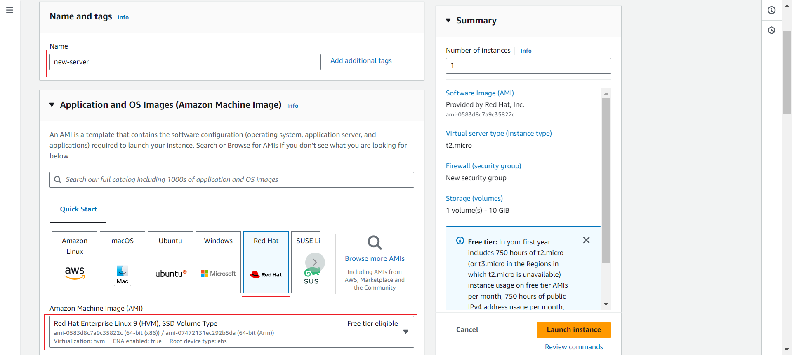

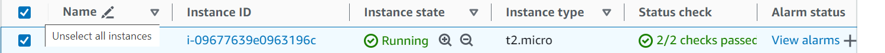

- **Configure LVM (Logical Volume Manager)on the Server.**


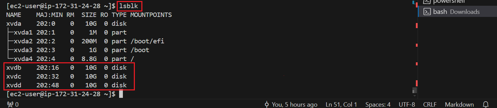

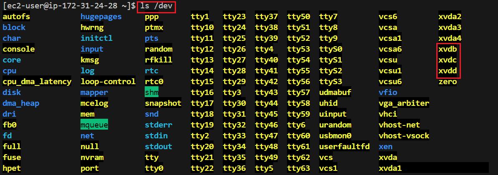
Use 
```
df -h 
```
command to see all mounts and free space on your server

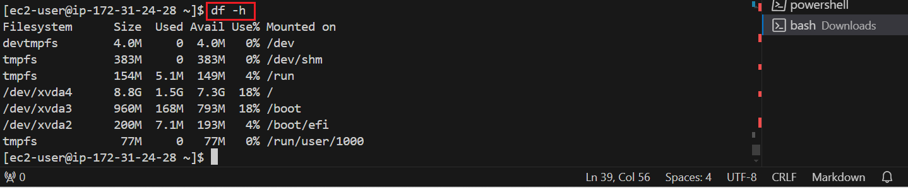


Use fdisk(fixed or format disk) utility to create a single partition on each of the 3 disks.

List all available disks:
```
sudo fdisk -l
```
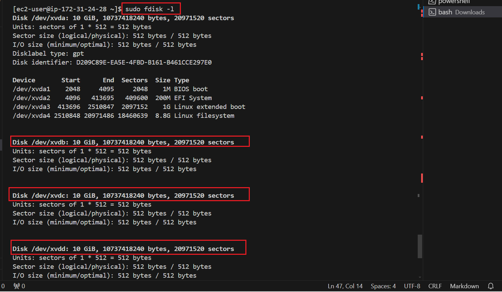

sudo fdisk /dev/xvdb
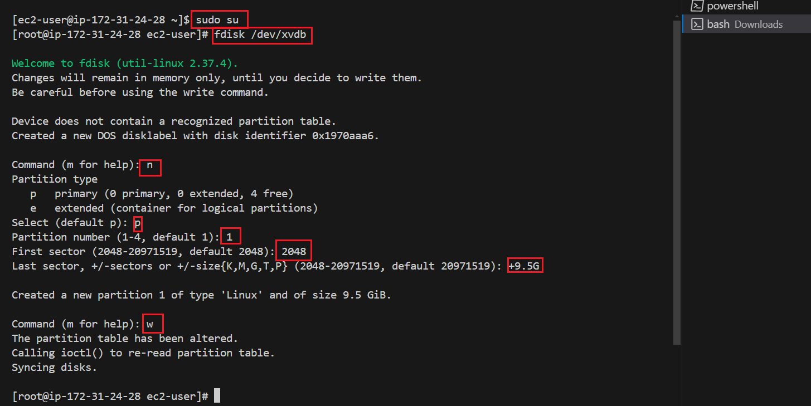

Repeat the above steps for /dev/xvdc & /dev/xvdd

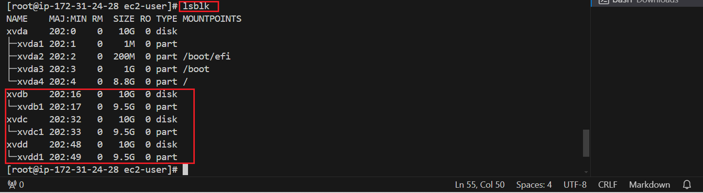

Install lvm2 package using 
```
sudo yum install lvm2
```
Run 
```
sudo lvmdiskscan
```
 command to check for available partitions.

 **LVM2 (Logical Volume Manager 2)** is a system that allows you to manage disk storage in a more flexible and powerful way compared to traditional partitioning methods. Here's a simple breakdown of what LVM2 does and why it's useful:

**Key Concepts**

**`Physical Volumes (PVs):`**
These are your actual physical hard drives or partitions.
Think of them as the raw storage building blocks.

**`Volume Groups (VGs):`**
These are created by combining multiple physical volumes into a single, larger pool of storage.

Imagine combining several Lego blocks into one big block.

**`Logical Volumes (LVs):`**
These are the actual "partitions" you use to store data, created from the storage pool of a volume group.
You can think of them as flexible containers inside the big Lego block.

**Why Use LVM2?**

**`Flexibility:`**
You can easily resize logical volumes without worrying about the underlying physical layout.
For example, if you need more space for your photos, you can increase the size of the logical volume where they are stored without having to move data around.

**`Easier Disk Management:`**
Adding new disks to your system is simpler. You can just add the new disk as a physical volume and extend your volume group, increasing the available storage pool.

**`Snapshots:`**
You can take snapshots of your logical volumes, which are useful for backups and quickly recovering from errors.
Efficient Use of Space:

Instead of having a fixed-size partition, you can allocate space as needed. This means you don't have to guess how much space each partition will need in the future.

**Real-Life Example**

Imagine you have two physical hard drives, each 500GB. You can use LVM2 to combine them into a single 1TB volume group. Then, you can create logical volumes for different purposes, such as one for your operating system, one for your photos, and one for your music. If you later buy another 500GB hard drive, you can easily add it to the volume group, increasing your total storage to 1.5TB without having to move any data around.

**Basic Commands**

Initialize a disk for use by LVM:
```
sudo pvcreate /dev/sdb
sudo pvcreate /dev/sdc
```

Create a volume group from the initialized disks:
```
sudo vgcreate my_volume_group /dev/sdb /dev/sdc
```

Create a logical volume from the volume group:
```
sudo lvcreate -n my_logical_volume -L 300G my_volume_group
```
Format the logical volume:
```
sudo mkfs.ext4 /dev/my_volume_group/my_logical_volume
```

Mount the logical volume:
```
sudo mkdir /mnt/my_storage
sudo mount /dev/my_volume_group/my_logical_volume /mnt/my_storage
```

Use **`pvcreate utility`** to mark each of 3 disks as physical volumes (PVs) to be used by LVM

```
sudo pvcreate /dev/xvdb1
sudo pvcreate /dev/xvdc1
sudo pvcreate /dev/xvdd1
```

Verify that your Physical volume has been created successfully by running 
```
sudo pvs
```
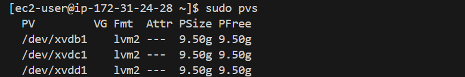

Use **`vgcreate utility`** to add all 3 PVs to a volume group (VG). Name the VG webdata-vg

```
sudo vgcreate webdata-vg /dev/xvdb1 /dev/xvdc1 /dev/xvdd1
```

Verify that your VG has been created successfully by running 
```
sudo vgs
```
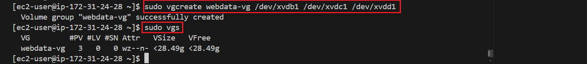

Use **`lvcreate utility`** to create 3 logical volumes. apps-lv (Use half of the PV size), and logs-lv Use the remaining space of the PV size. NOTE: apps-lv will be used to store data for the Website while, logs-lv will be used to store data for logs.

Ensure there are 3 Logical Volumes. `lv-opt` `lv-apps`, and `lv-logs` 
```
sudo lvcreate -n lv-opt -L 9.5G webdata-vg
sudo lvcreate -n lv-apps -L 9.5G webdata-vg
sudo lvcreate -n lv-logs -L 8.0G webdata-vg
```
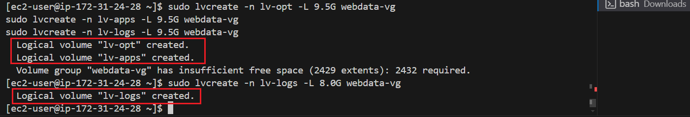

Create mount points on /mnt directory for the logical volumes as follow:

Mount `lv-apps on /mnt/apps` – To be used by webservers

Mount `lv-logs on /mnt/logs` – To be used by webserver logs

Mount `lv-opt on /mnt/opt` – To be used by Jenkins server in project 8.

Install NFS server, configure it to start on reboot and make sure it is u and running

Verify the entire setup 
```
sudo vgdisplay -v #view complete setup - VG, PV, and LV
```
Instead of formatting the disks as `ext4`, you will have to format them as `xfs`

**`xfs`**: XFS is a robust, scalable, and high-performance file system suitable for handling large files and large-scale storage needs. It offers advanced features such as metadata journaling, online defragmentation, and resizing, making it an excellent choice for enterprise and high-performance computing environments.
```
sudo mkfs -t xfs /dev/webdata-vg/apps-lv
sudo mkfs -t xfs /dev/webdata-vg/logs-lv
sudo mkfs -t xfs /dev/webdata-vg/opt-lv
```

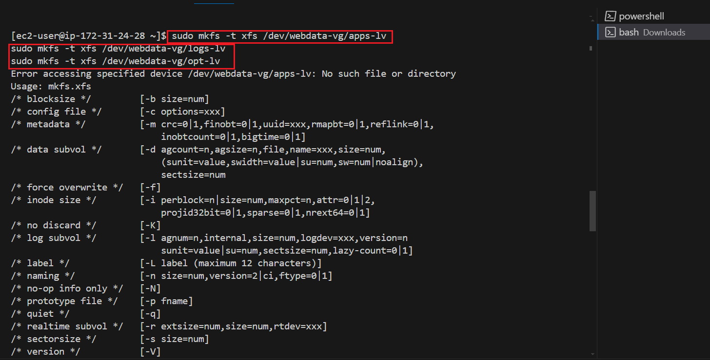

Create mount points on /mnt directory for the logical volumes as follow:
```
Mount lv-apps on /mnt/apps – To be used by webservers
Mount lv-logs on /mnt/logs – To be used by webserver logs
Mount lv-opt on /mnt/opt – To be used by Jenkins server in Project 8
```
```
sudo mkdir -p /mnt
cd mnt
ls
sudo mkdir apps logs opt
```

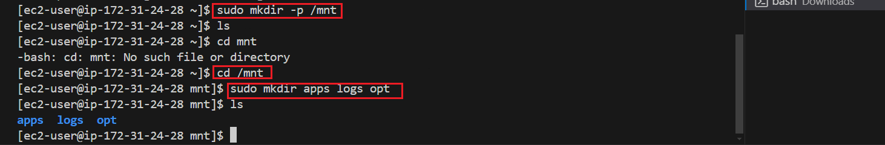